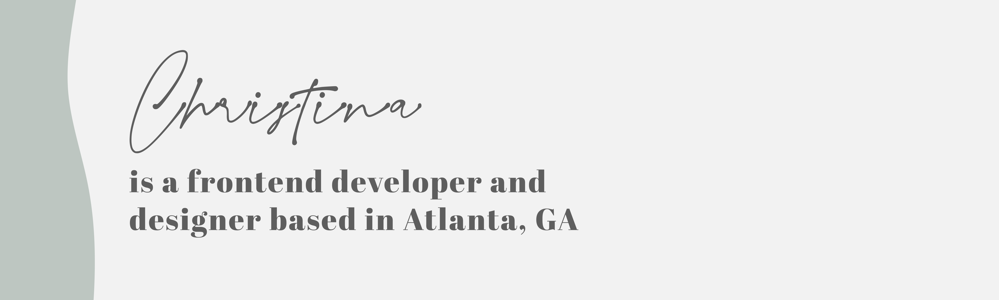

# Hello there! I'm Christina.

I am currently a coding bootcamp student with General Assembly and on track to graduate at the end of November of this year. In the meantime, I am excited to explore the industry and leverage my problem-solving skills and creativity to a lifetime of learning with other like-minded individuals.

Currently, I developing my proficiency in JavaScript to create my first project for my portfolio. 

As I continue honing my technical skills, I look forward to connecting with other developers to work on creative and innovative projects.

- 📍 Atlanta, Georgia
- Hobbies: Watching crime documentaries and going on long walks around the city.
- Pronouns: She/Her
- Editor of Choice: VS Code 

### Education 

- Software Engineering Immersive Bootcamp at General Assembly 
- BS in Earth and Atmospheric Sciences from the Georgia Institute of Technology (Class of 2020)

